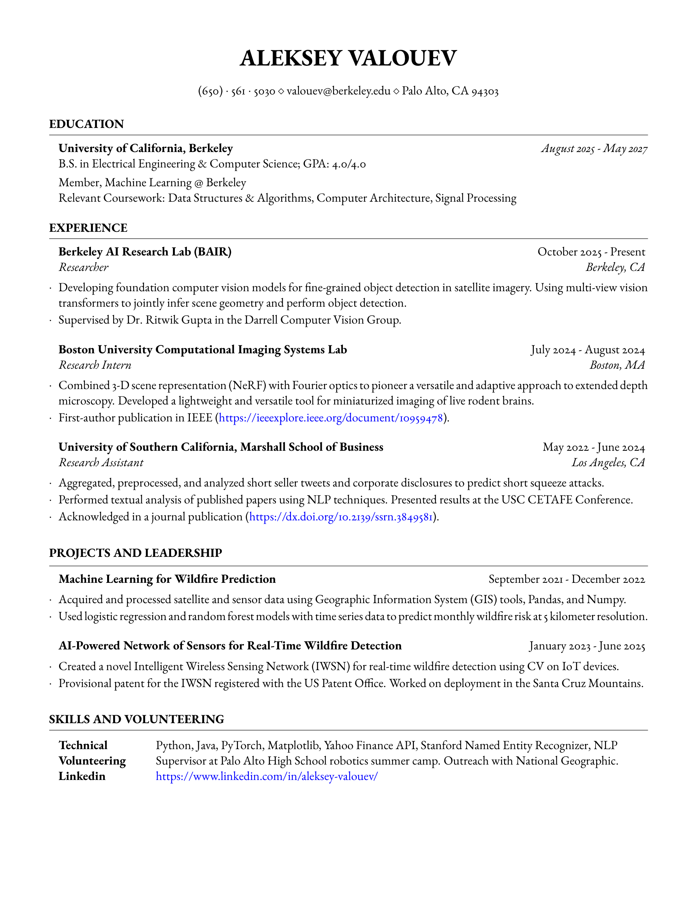

# CV (Last Updated 12/29/25)

<p align="center">
  <a href="aleksey_valouev_cv.pdf">
    
  </a>
</p>

[Download PDF](aleksey_valouev_cv.pdf)

## Usage

To update the README preview after modifying the CV, run:

```bash
./generate_preview.sh
```

## Template Credits

This template is based on the [Medium Length Professional CV](https://www.latextemplates.com/template/medium-length-professional-cv) template from [LaTeX Templates](https://www.latextemplates.com/).

Author: [Vel](vel@latextemplates.com)

Original author: [Trey Hunner](http://www.treyhunner.com/)

License: CC BY-NC-SA 4.0 