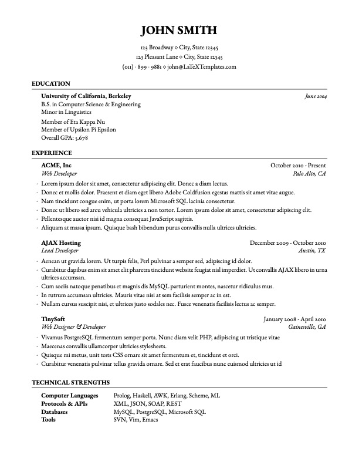

# CV

<p align="center">
  <a href="template.pdf">
    
  </a>
</p>

[Download PDF](template.pdf)

## Usage

To update the README preview after modifying the CV, run:

```bash
./generate_preview.sh
```
